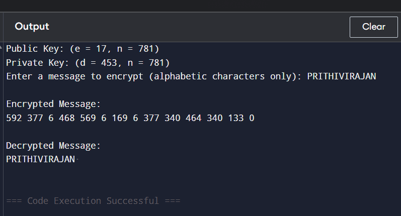

## EX-NO-9-RSA-Algorithm
## Date: 17-04-2025
### AIM:
To Implement RSA Encryption Algorithm in Cryptography

### Algorithm:
### Step 1: Design of RSA Algorithm
The RSA algorithm is based on the mathematical difficulty of factoring the product of two large prime numbers. It involves generating a public and private key pair, where the public key is used for encryption, and the private key is used for decryption.

### Step 2: Implementation 
In Python or C This algorithm can be implemented in languages like Python or C by performing large integer calculations for key generation, encryption, and decryption, utilizing libraries for modular arithmetic if necessary.

### Step 3: Algorithm Description

1. Key Generation:

 * Select two large prime numbers ( p ) and ( q ).
 * Calculate ( n = p \times q ), which will be used as the modulus.
 * Compute the totient ( \phi(n) = (p - 1)(q - 1) ).
 * Choose a public exponent ( e ) such that ( e ) is coprime with ( \phi(n) ).
 * Compute the private key ( d ), which is the modular inverse of ( e ) mod ( \phi(n) ).
2. Encryption:

 * Convert the plaintext message ( M ) into a numerical form ( m ) (such that ( 0 \le m < n )).
 * Compute the ciphertext ( c ) using the formula: ( c = m^e \mod n ).
 3. Decryption:

 * Use the private key ( d ) to recover ( m ) from ( c ) using: ( m = c^d \mod n ).
 * Convert ( m ) back into the original message ( M ).
Step 4: Mathematical Representation

 * Encryption: ( E(m) = m^e \mod n )
 * Decryption: ( D(c) = c^d \mod n )
### Step 5: Security Foundation
The security of RSA relies on the difficulty of factoring large numbers; thus, choosing sufficiently large prime numbers for ( p ) and ( q ) is crucial for security.

### Program:
```

#include <stdio.h>
#include <string.h>
#include <math.h>
#include <ctype.h>
#include <stdlib.h>

int gcd(int a, int b) {
    while (b != 0) {
        int temp = b;
        b = a % b;
        a = temp;
    }
    return a;
}

long long mod_exp(long long base, long long exp, long long mod) {
    long long result = 1;
    while (exp > 0) {
        if (exp % 2 == 1)
            result = (result * base) % mod;
        base = (base * base) % mod;
        exp = exp / 2;
    }
    return result;
}

int mod_inverse(int e, int phi) {
    int t = 0, newt = 1;
    int r = phi, newr = e;
    while (newr != 0) {
        int quotient = r / newr;
        int temp = t;
        t = newt;
        newt = temp - quotient * newt;
        temp = r;
        r = newr;
        newr = temp - quotient * newr;
    }
    if (r > 1) return -1; 
    if (t < 0) t = t + phi;
    return t;
}

int main() {
    
    int p = 11;
    int q = 71;
    
    int n = p * q;
    int phi = (p - 1) * (q - 1);

    int e = 17; 
    if (gcd(e, phi) != 1) {
        printf("e and phi(n) are not coprime!\n");
        return -1;
    }
    int d = mod_inverse(e, phi);
    if (d == -1) {
        printf("No modular inverse found for e!\n");
        return -1;
    }

    printf("Public Key: (e = %d, n = %d)\n", e, n);
    printf("Private Key: (d = %d, n = %d)\n", d, n);

    char message[100];
    printf("Enter a message to encrypt (alphabetic characters only): ");
    fgets(message, sizeof(message), stdin);
    
    int len = strlen(message);
    
    if (message[len - 1] == '\n') message[len - 1] = '\0'; 
    
    printf("\nEncrypted Message:\n");
    
    long long encrypted[100];
    
    for (int i = 0; i < len; i++) 
    {
        int m = (int)message[i];  
        
        encrypted[i] = mod_exp(m, e, n); 
        
        printf("%lld ", encrypted[i]);  
    }
    printf("\n");

    printf("\nDecrypted Message:\n");
    for (int i = 0; i < len; i++) {
        int decrypted = (int)mod_exp(encrypted[i], d, n); 
        
        printf("%c", (char)decrypted); 
        
    }
    printf("\n");

    return 0;
}
```
### Output:

### Result:
The program is executed successfully.
